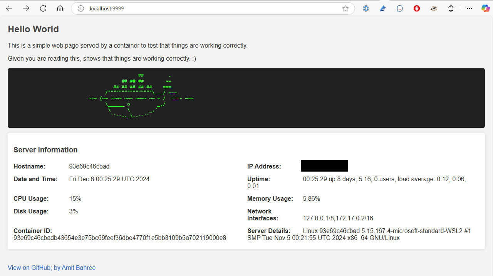

# Hello World

This is a simple Docker image that just gives HTTP responses on a configurable port. It's small enough (~4.2 mb) to fit on one floppy disk 💾!

```bash
$ docker images | grep hello-world
REPOSITORY                      TAG       IMAGE ID        CREATED          VIRTUAL SIZE
amitbahree/hello-world          latest    de265d51837e    5 hours ago    4.28MB
```
**Question:** What is a floppy disk? 🤔

There is often a scenario where you neeed a simple web server to test things out and make sure everything is wired up OK. This image is a simple web server that listens on port 8000 and returns a simple HTML page and shows some server details. It is based on the [Busybox Linux](https://www.busybox.net/about.html/) image.

## Sample Usage

### Starting a web server on port 9999

```bash
$ docker run -d --rm -p 9999:8000 amitbahree/hello-world
```
The image below shows an example of what this would look like.



If the page renders, and you see the server details, then you are good to go. If you don't see the page, then you might have a firewall issue or the port is already in use, or some problem with the Docker daemon.

I often use this image to test out things like Kubernetes, Docker, Firewalls, and other things where I need a simple web server to test things out.

You can also interact with this and browse to is using a browser or use `curl` to interact with it as shown below:

```bash
$ curl http://localhost:9999/cgi-bin/serverinfo.sh
```
In the console, you should see something similart to the image below.


### Building and Publishing to GitHub Registry

To build and publish the image to GitHub Container Registry:

```bash
# Build the Docker image
$ docker build -t amitbahree/hello-world .

# Log in to GitHub Container Registry
$ echo $GITHUB_TOKEN | docker login ghcr.io -u USERNAME --password-stdin

# Tag the image
$ docker tag amitbahree/hello-world ghcr.io/amitbahree/hello-world:latest

# Push the image
$ docker push ghcr.io/amitbahree/hello-world:latest
```

### Acknowledgments

This project is a fork of Chri's [docker-hello-world](https://github.com/crccheck/docker-hello-world). Special thanks to Chris for their valuable work.
